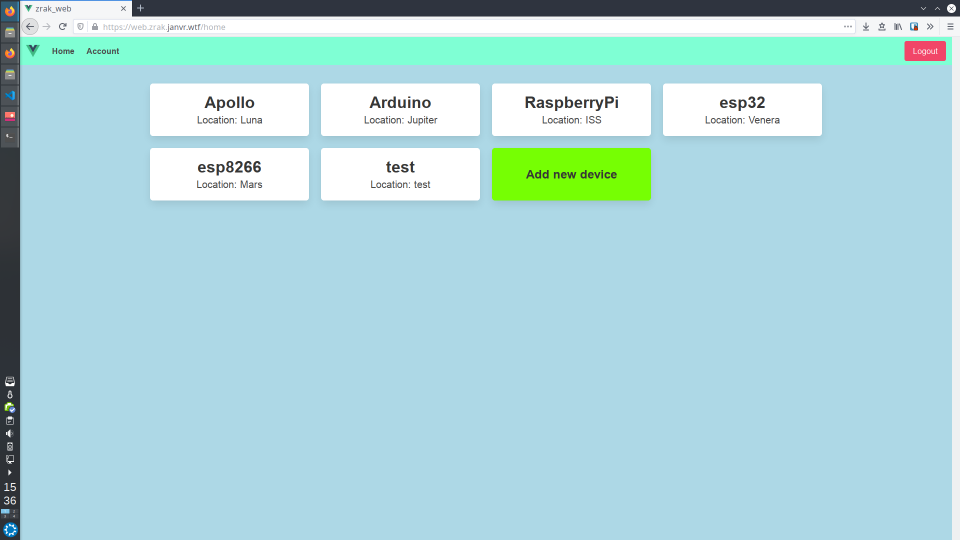
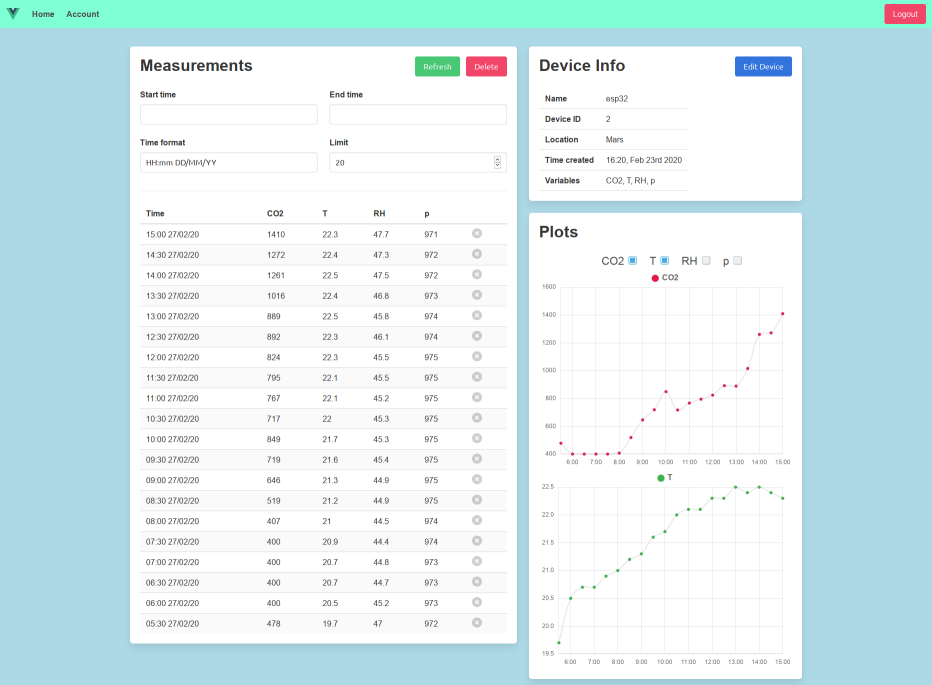
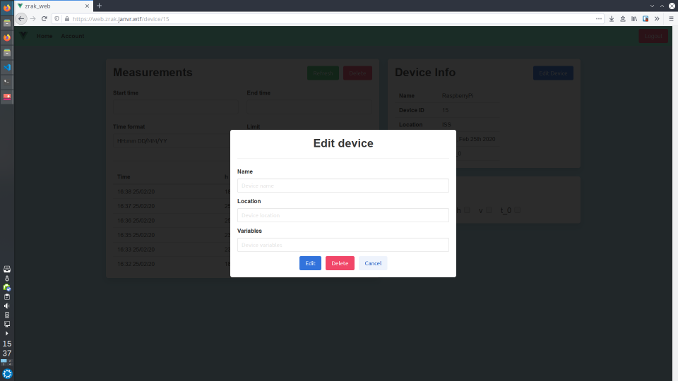

# Projekt IoT platforma
#### Seminar iz načrtovanja in razvoja programske opreme v telekomunikacijah 2020
---
## Spletna aplikacija
Spletna aplikacija omogoča dostop do naslednjih funkcionalnosti API-ja:
- Ustvarjanje novega uporabnika
- Spreminjanje podatkov uporabnika
- Brisanje uporabnika
- Dodajanje novih naprav
- Spreminjanje podatkov naprav
- Brisanje že obstoječih naprav
- Pregled meritev posamezne naprave
- Brisanje meritev

Delujoča verzija aplikacije je dostopna na [web.zrak.janvr.wtf](https://web.zrak.janvr.wtf). Za vstop se lahko ustvari nov uporabnik ali pa se uporabi že obstoječ demo uporabnik (uporabniško ime: test, geslo: test).

Aplikacija je izdelana s pomočjo JavaScript ogrodja [Vue.js](https://vuejs.org) in CSS ogrodja [Bulma](https://bulma.io). 

Za zagon aplikacije na lastnem računalniku potrebujemo nameščeno JavaScript okolje [Node.js](https://nodejs.org). Nato odpremo ukazno vrstico v mapi tega repozitorija in izvedemo ukaze:
```
$ npm install
$ npm run serve
```
Ukaz ```npm install``` namesti vse potrebne knjižnice in se izvede samo ob prvem zagonu aplikacije.


### Screenshots



